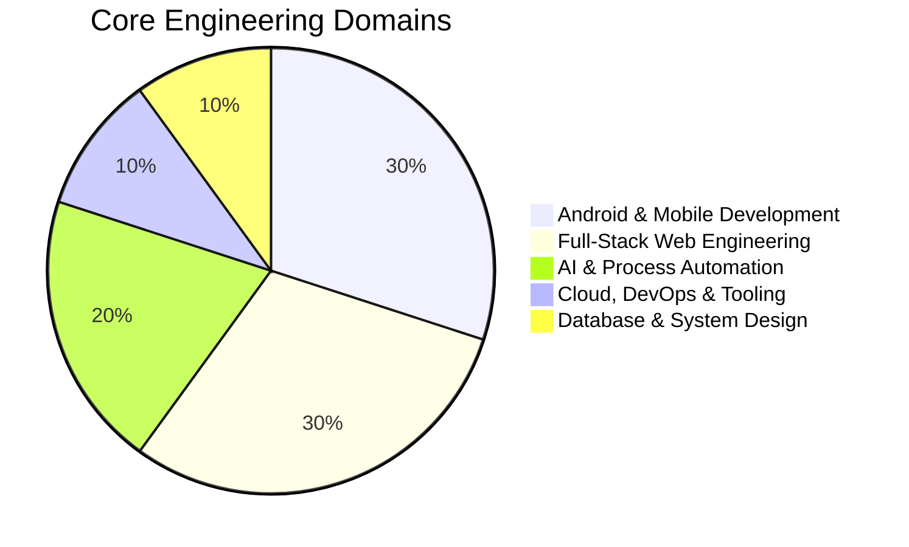
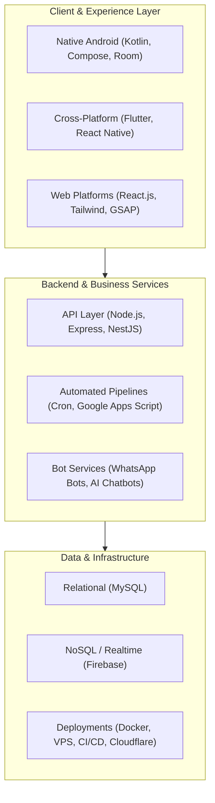
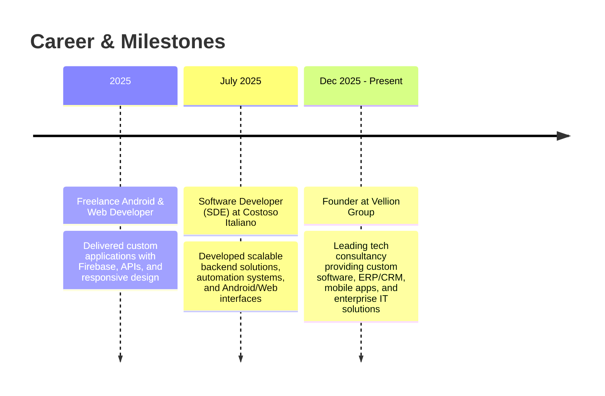

# 👋 Hi there, I'm Jay Agarwal

### **Founder, [Vellion Group](https://velliongroup.in) | Full-Stack Developer & Automation Architect**

 

> *"Engineering digital systems, mobile applications, and intelligent automation that power modern enterprises."*

---

## 👨‍💻 About Me

I am a **Polyglot Software Engineer**, **Full-Stack Developer**, and **Technical Founder** currently pursuing my **MCA at VIT Vellore**. 

At **[Vellion Group](https://velliongroup.in)**, I lead technical architecture, enterprise software engineering, and digital transformation initiatives. I specialize in building **high-performance Android apps (Kotlin + Jetpack Compose)**, **scalable web applications (React + Node.js/NestJS)**, **business CRMs/ERPs**, and **intelligent workflow automation systems** that eliminate manual overhead.

- 🔭 **Currently Building**: Scalable enterprise platforms, CRM suites, and AI-driven business workflows at **Vellion Group**.
- 🎓 **Education**: Master of Computer Applications (MCA), **Vellore Institute of Technology (VIT)**.
- 💡 **Core Expertise**: Native Android, Full-Stack Web Development, Workflow & Bot Automation, Microservices & APIs.
- 💬 **Ask Me About**: Kotlin, Jetpack Compose, React, Node.js, System Architecture, WhatsApp Bots, and Automation pipelines.
- 📫 **How to reach me**: [jay@jayagarwal.in](mailto:jay@jayagarwal.in) or connect via [LinkedIn](https://www.linkedin.com/in/jayagarwal634).

---

## 📊 Technical Focus & Domain Breakdown

---

## 🏗️ Architecture & Solutions Ecosystem

---

## 🛠️ Technology Stack & Skills

### 📱 Mobile Development

  
  
  
  
  
  
  
  
  

### 💻 Web & Frontend Engineering

  
  
  
  
  
  
  
  

### ⚙️ Backend, APIs & System Architecture

  
  
  
  
  
  
  

### 🗄️ Databases & Storage

  
  
  
  

### 🤖 Automation, Bots & AI

  
  
  
  
  

### ☁️ DevOps, Cloud & Analytics

  
  
  
  
  
  
  
  

---

## 🚀 Featured Projects & Enterprise Implementations

| Project | Domain | Stack | Highlights & Achievements |
| :--- | :--- | :--- | :--- |
| **Attendance CRM** | Enterprise CRM | `Kotlin` `React` `Node.js` `MySQL` | Real-time attendance logging, order management, inventory tracking, and client records. |
| **InvestWise India** | Fintech / Mobile | `Android` `Kotlin` `Firebase` | AI-assisted mutual fund comparison, curated beginner insights, and portfolio tracking. |
| **WhatsApp Automation Suite** | Process Automation | `Node.js` `Express` `MySQL` | Automated messaging bot for group coordination, scheduling, alerts, and customer engagement. |
| **Opalia Homes** | E-Commerce / Retail | `Web` `Responsive UI` `Liquid` | Luxury home decor digital store showcasing catalog items, dynamic filtering, and brand identity. |
| **Hotel & Cafe Automation** | Hospitality & Booking | `React` `Node.js` `Apps Script` | Real-time room availability, payment integration, table ordering, and automated email receipts. |
| **MCD Urban Solution** | Civic / Government | `React` `Web Technologies` | Civic engagement and municipal solution portal providing streamlined digital services. |
| **Corporate News Portal** | Mobile Application | `Android` `Kotlin` `REST API` | Real-time article fetching, categorized feeds, offline caching, and search capabilities. |
| **Conversational AI Chatbot** | AI & NLP | `Android` `REST APIs` `NLP` | Intelligent automated inquiry assistant integrated across mobile and web channels. |

---

## 📈 GitHub Statistics

 

---

## 💼 Experience & Ventures

---

## 🤝 Let's Connect & Collaborate!

I am always interested in discussing technical challenges, building custom software, or collaborating on innovative products.

- 🌐 **Personal Website**: [jayagarwal.in](https://jayagarwal.in)
- 🏢 **Company Website**: [velliongroup.in](https://velliongroup.in)
- 💼 **Live Portfolio**: [velliongroup.in/portfolio/](https://velliongroup.in/portfolio/)
- 📧 **Direct Email**: [jay@jayagarwal.in](mailto:jay@jayagarwal.in) / [contact@velliongroup.in](mailto:contact@velliongroup.in)
- 📱 **Direct Call / WhatsApp**: [+91 8791962971](https://wa.me/918791962971)
- 💼 **LinkedIn**: [linkedin.com/in/jayagarwal634](https://www.linkedin.com/in/jayagarwal634)
- 🐦 **Twitter / X**: [@jayagarwal634](https://twitter.com/jayagarwal634)

  Designed with ❤️ by <b>Jay Agarwal</b>. Powered by code, coffee, and clean architecture.

