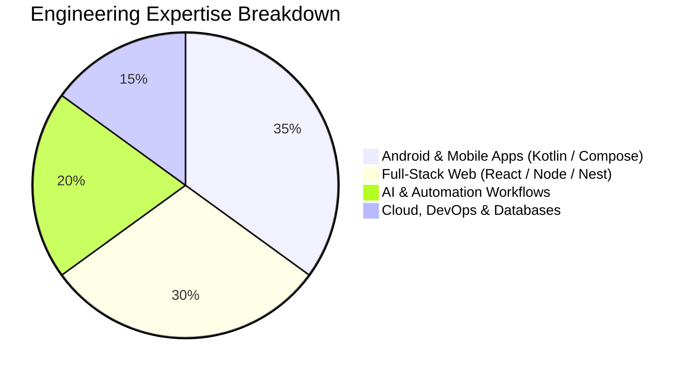
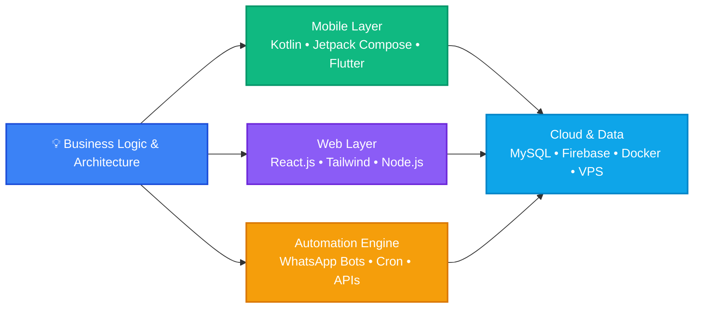

<div align="center">

# ⚡ Jay Agarwal

### **Founder, [Vellion Group](https://velliongroup.in) • Mobile & Full-Stack Engineer • Automation Architect**

<p align="center">
  <a href="https://jayagarwal.in"></a>
  <a href="https://velliongroup.in"></a>
  <a href="https://www.linkedin.com/in/jayagarwal634"></a>
  <a href="https://twitter.com/jayagarwal634"></a>
  <a href="https://wa.me/918791962971"></a>
</p>

```
 Building Digital Systems • Android & Web Apps • AI Workflows
```

</div>

---

###  Quick Highlights

| **Role** | **Company** | **Education** | **Location** |
| :--- | :--- | :--- | :--- |
| **Founder & Lead Engineer** | [Vellion Group](https://velliongroup.in) | **MCA**, VIT Vellore | Agra, India |

---

## Technical Focus & Distribution



---

## Core Technology Workflow



---

## Stack & Toolbelt

<table>
  <tr>
    <td align="center" width="16%"><b>Mobile</b></td>
    <td>
      
      
      
      
      
      
    </td>
  </tr>
  <tr>
    <td align="center"><b>Frontend</b></td>
    <td>
      
      
      
      
      
      
      
    </td>
  </tr>
  <tr>
    <td align="center"><b>Backend</b></td>
    <td>
      
      
      
      
      
      
    </td>
  </tr>
  <tr>
    <td align="center"><b>Database</b></td>
    <td>
      
      
      
      
    </td>
  </tr>
  <tr>
    <td align="center"><b>Automation</b></td>
    <td>
      
      
      
      
      
    </td>
  </tr>
  <tr>
    <td align="center"><b>Cloud & Ops</b></td>
    <td>
      
      
      
      
      
      
    </td>
  </tr>
</table>

---

## Featured Deployments

| Project | Category | Tech Stack | Status / Link |
| :--- | :--- | :--- | :---: |
| **Attendance CRM** | Enterprise System | `Kotlin` `React` `Node.js` `MySQL` | 🟢 [Enterprise Portal](https://velliongroup.in) |
| **InvestWise India** | Fintech / Mobile | `Android` `Kotlin` `Firebase` | 🟢 [Explore Project](https://github.com/jayagarwal-github) |
| **WhatsApp Automation Suite** | Process Automation | `Node.js` `Express` `MySQL` | 🟢 [Live Solution](https://velliongroup.in) |
| **Opalia Homes** | Luxury E-Commerce | `React` `Tailwind` `Liquid` | 🟢 [opaliahomes.com](https://opaliahomes.com) |
| **Hotel & Cafe Automation** | Hospitality & Booking | `React` `Node.js` `Apps Script` | 🟢 [Live Preview](https://hotel.vellion.me) |
| **MCD Urban Solution** | Civic Platform | `React` `REST APIs` | 🟢 [Live Portal](https://mcdurbansolution.velliongroup.in) |

---

## Activity & Stats

<div align="center">


<br/>


</div>

---

## Connect With Me

<p align="center">
  <a href="mailto:jay@jayagarwal.in"></a>
  <a href="https://wa.me/918791962971"></a>
  <a href="https://www.linkedin.com/in/jayagarwal634"></a>
  <a href="https://velliongroup.in/portfolio/"></a>
</p>

<div align="center">
  <sub>© 2026 <b>Jay Agarwal</b> • Vellion Group</sub>
</div>
